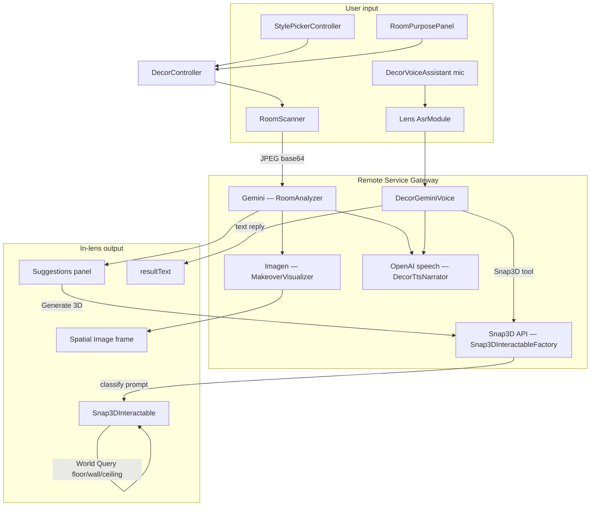

# Décor3D for Spectacles

**Décor3D** orchestrates **Remote Service Gateway (RSG)** and Spectacles platform APIs — **Gemini**, **Imagen**, **OpenAI TTS**, **Lens ASR**, **Snap3D**, **SIK**, **World Query**, **Spatial Image**, and the **Camera Module** — into one home-design flow: **scan → understand → redesign → place**.

Where mobile decor apps stop at inspiration images, Décor3D lets you try ideas **in the room you are standing in**: scan and understand the real layout, get a spatial makeover on glasses, generate decor in 3D, place it on the surface that actually fits — and, when two people are in the same room, **share one AI-generated model** instead of paying for it twice.

**Prior Spectacles work:** [decor-assistant-spectacles](https://github.com/urbanpeppermint/decor-assistant-spectacles) (first iteration) → [Enhanced_AI_Decor_Assistant](https://github.com/urbanpeppermint/Enhanced_AI_Decor_Assistant) → **Décor3D** (this repo).

---

## What this build delivers

- **Colocated co-design** — Connected Lenses + `DecorSessionManager` keep both wearers on the same style, scan phase, analysis, and UI state. Only the **session leader** runs camera capture, Gemini, Imagen, and **one** Snap3D job; the follower does not trigger a second generation.
- **One GLB, every device** — The leader’s Snap3D result is published as a **shared mesh URL**. The second player **downloads and instantiates that same GLB** locally, with synced loading UI at the shared spawn pose, so both see identical geometry without duplicate API cost or mismatched models.
- **Live shared placement** — `SyncTransform` streams position, rotation, and scale while either person drags a prop; last interaction wins so co-design feels like one scene, not two parallel lenses.
- **Duplicate 3D** — After a mesh is ready, **Duplicate 3D** deep-clones the finished interactable at the **original generation anchor** with no second Snap3D round-trip — useful for pairs, symmetry, or repeating a piece you already paid to generate.
- **Prompt-aware surfaces** — The factory classifies each object from its text (rug vs wall art vs pendant) and picks **floor, wall, or ceiling** World Query paths (including multi-ray wall snap) instead of dropping everything on the nearest hit.
- **Layout-locked room pipeline** — Gemini vision turns a captured JPEG into structured room analysis and makeover prompts; Imagen renders against that layout; **Spatial Image** adds depth on Spectacles hardware for the in-room makeover plane.
- **Voice co-pilot** — ASR → Gemini `models()` (with post-scan room context) → OpenAI TTS: decor advice, where-to-buy dialogue, or a spoken Snap3D request that uses the same placement rules as the suggestion panel.

---

## User flow

```
Pick style ──▶ Purpose (scroll) or SKIP ──▶ Scan ──▶ Capture ──▶ Results
                                    │
        ┌───────────────────────────┴───────────────────────────┐
        ▼                                                       ▼
 Spatial makeover                          Suggestions panel + TTS
 (Imagen + Spatial Image on device)        (text + where-to-buy hints)
        │                                   Prev/Next ──▶ Generate 3D
        │                                                       │
        └──────────────────── RESTART (any time) ◀──────────────┘

After Generate 3D:
  Preview image (position freely) ──▶ mesh ──▶ snap to matching surface
  Pinch-drag, rotate, scale (up to 15×)

Voice overlay (any time):
  Mic button ──▶ greeting (TTS) ──▶ listen (ASR) ──▶ Gemini reply (TTS)
  Ask anything: decor advice, where to buy (asks your location first), or "add a X" → Snap3D
```

| Step | What you see |
|------|--------------|
| **Style / purpose** | Pick a look, or repurpose the room, or skip |
| **Scan** | Live preview, then still capture |
| **Makeover** | Layout-aware spatial result on glasses |
| **Suggestions** | Decor ideas + where to look for products (text) |
| **3D** | Generate from one suggestion; snaps to the right surface automatically |
| **Voice** | Mic toggle; spoken Gemini answers and can trigger 3D generation |
| **RESTART** | Clean slate without reloading the Lens binary |

---

## Context-aware surface placement

This is more than a World Query integration. The factory reads the **Snap3D prompt** — which comes from the suggestion text — and classifies each object before it is placed. Floor/table items snap down, wall items snap to vertical surfaces, ceiling items hang from above. The same World Query hit-test API is used in all three paths, but the direction, acceptance criteria, and placement math differ per class.

### How classification works (`Snap3DInteractableFactory`)

The prompt (or the suggestion title and detail that built it) is checked against three keyword groups before the object is instantiated:

| Surface | How a hit is accepted | What placement does |
|---------|-----------------------|---------------------|
| **Floor / table** (default) | Normal points up (`normalY ≥ 0.85`) | Root placed at hit + half display height; drag-release snaps downward within `snapProximityCm` |
| **Wall** | Normal near-horizontal (`|normalY| ≤ 0.3`) | 8 horizontal rays around the drop point; closest wall within `wallSnapProximityCm`; object oriented facing into the room |
| **Ceiling** | Normal points down (`normalY ≤ −0.85`) | Ray upward; object hangs `ceilingDropCm` below the hit |

### Wall keyword coverage (selected)

Shelving, floating shelf, wall shelf, spice rack · curtains, drapes, blinds, valance · paintings, canvas, wall art, framed, poster, print, mural, tapestry, macramé · mirror, wall mirror · wall lamp, sconce, picture light, vanity light · wall clock, whiteboard, corkboard, pegboard · coat rack, towel bar, key holder, wall organizer · wall planter, vertical garden · backsplash, wall tile, wainscoting, wallpaper, accent wall…

### Ceiling keyword coverage (selected)

Chandelier, pendant light/lamp, ceiling lamp/light/fan, flush mount, semi-flush, track lighting · hanging plant, hanging planter, hanging basket, hanging lantern · suspended light/lamp…

Everything else — sofas, tables, rugs, floor lamps, potted plants, bookcases — defaults to the floor/table path without needing a keyword.

### Per-item tuning (`Snap3DInteractable` inspector)

| Group | Input | Default | Effect |
|-------|-------|---------|--------|
| Surface Snapping | `snapProximityCm` | 50 | Snap range on release (floor/table) |
| Wall Snapping | `wallSnapProximityCm` | 50 | Snap range on release (wall) |
| Wall Snapping | `wallClearanceCm` | 2 | Gap from wall; small negative to sit flush |
| Wall Snapping | `wallFacingFlip` | off | Flip if item faces into the wall |
| Ceiling Snapping | `ceilingSnapProximityCm` | 80 | Snap range upward (ceilings are higher) |
| Ceiling Snapping | `ceilingDropCm` | 20 | How far the item hangs below the hit |
| Display Size | `baseDisplaySize` | 40 | Base scale (cm) |
| Manipulation | `maxScaleFactor` | 15 | Max pinch scale |

---

## Voice assistant overlay (`DecorVoiceAssistant` + `DecorGeminiVoice`)

A mic toggle runs a voice layer on top of the existing flow — no mode switch, no extra steps. It works alongside whatever the main flow is doing.

| Stage | API |
|-------|-----|
| **Listen** | Lens `AsrModule` (Spectacles ASR) |
| **Think** | RSG **Gemini `models()`** (`DecorGeminiVoice`) — same pattern as `RoomAnalyzer` |
| **Speak** | RSG **OpenAI TTS** (`DecorTtsNarrator.speakPlainText`) |

On first press the assistant speaks a short greeting (TTS), then starts listening when playback finishes. While the mic is on, each utterance goes to Gemini; replies are spoken and shown in `resultText`.

| What you say | What happens |
|--------------|--------------|
| "Add a pendant lamp" / "Create a boho rug" | `Snap3D` function call → factory generates + places on the right surface |
| "Where can I find this?" | Assistant asks which city or area first, then suggests store types / retailers |
| Decorating/style/colour questions | Short spoken answer + text in `resultText` |
| Tap mic again | Listening stops; session stays open for the next tap |

**Implementation:** `DecorVoiceAssistant.ts` owns the mic toggle, ASR, and Snap3D routing. `DecorGeminiVoice.ts` owns Gemini chat history and the Snap3D tool declaration. Voice-requested items use the same prompt-based surface classification as suggestion-driven ones.

---

## RSG & platform stack

| Layer | Role in Décor3D |
|-------|-----------------|
| **RSG → Gemini** | Room analysis (`RoomAnalyzer`) + voice turns (`DecorGeminiVoice`) |
| **RSG → Imagen** | Makeover image from structured prompts (`MakeoverVisualizer`) |
| **RSG → OpenAI TTS** | Spoken makeover summary + voice replies (`DecorTtsNarrator`) |
| **Lens ASR** | Speech input on Spectacles (`DecorVoiceAssistant`) |
| **RSG → Snap3D** | Object mesh from suggestion or voice (`Snap3DInteractableFactory`) |
| **Spatial Image** | Depth spatial makeover on Spectacles |
| **World Query** | Surface hit-test — floor, wall, and ceiling paths |
| **SIK** | Scroll views, pinch drag, rotate, scale |
| **Camera Module** | Live preview + capture (`RoomScanner`) |

---

## Architecture

`DecorController` is the root orchestrator: it drives UI state, optional **room repurpose** (`targetPurpose`), the two-step scan, and session **RESTART**. All cloud AI goes through **RSG**; in-lens depth and placement use **Spatial Image** and **World Query**.

### End-to-end pipeline

```
Style + purpose (optional) → live scan → JPEG capture
        → Gemini (RoomAnalyzer): layout, suggestions, makeoverPrompt [+ targetPurpose]
        → Imagen (MakeoverVisualizer): layout-aware 2D concept → Spatial Image on device
        → OpenAI TTS (DecorTtsNarrator): spoken summary
        → Suggestions panel (DecorShoppingPanel): paginated ideas + where-to-buy hints
        → User picks slide → Snap3D factory classifies prompt → Snap3DInteractable
        → World Query: floor ray / 8-direction wall rays / upward ceiling ray → place on match

Voice overlay (parallel):
        Mic button → TTS greeting → ASR → Gemini.models()
        → TTS reply + Snap3D tool call OR resultText
        → Snap3DInteractableFactory (same surface classification)
```

### System diagram



### Core modules

| Module | Responsibility |
|--------|----------------|
| `DecorController.ts` | State machine, UI visibility, `targetPurpose`, RESTART |
| `StylePickerController.ts` + scroll creators | Style catalog (SIK `ScrollView`) |
| `RoomPurposePanel.ts` + `PurposeScrollContentCreator.ts` | Optional repurpose step |
| `RoomScanner.ts` | Camera Module live preview + JPEG capture |
| `RoomAnalyzer.ts` | RSG Gemini vision → structured `RoomAnalysis` |
| `MakeoverVisualizer.ts` | RSG Imagen → texture → Spatial Image |
| `DecorTtsNarrator.ts` | RSG OpenAI speech — makeover summary + voice replies |
| `DecorGeminiVoice.ts` | RSG Gemini `models()` for voice turns + Snap3D tool |
| `DecorShoppingPanel.ts` | Suggestions UI, prev/next, Generate 3D entry |
| `DecorSnap3DGenerator.ts` + `DecorSnap3DPrompt.ts` | Status, dismiss, object-only prompts |
| `Snap3DInteractableFactory.ts` | RSG Snap3D submit + surface class detection |
| `Snap3DInteractable.ts` | Phased preview → mesh, floor/wall/ceiling snap, SIK manipulation |
| `DecorVoiceAssistant.ts` | Mic toggle, ASR, wires `DecorGeminiVoice` + Snap3D factory |
| `DecorSessionManager.ts` | Connected Lens sync — phase, analysis, Snap3D, shared transforms |
| `DecorMultiplayerController.ts` | 1-player / 2-player toggle → starts colocated session |

---

## Project structure

```
New_DecorAI/
├── README.md
├── Assets/
│   ├── Scene.scene
│   ├── Prefabs/Snap3DInteractable.prefab
│   └── Scripts/
│       ├── DecorAI/              ← Décor3D module (folder name unchanged)
│       │   ├── DecorController.ts
│       │   ├── DecorSessionManager.ts
│       │   ├── DecorMultiplayerController.ts
│       │   ├── DecorVoiceAssistant.ts
│       │   ├── DecorGeminiVoice.ts
│       │   └── …
│       ├── Snap3DInteractable.ts
│       └── Snap3DInteractableFactory.ts
└── Tools/
```

---

## Quick start

1. Open `Assets/Scene.scene` in Lens Studio **5.15+**.
2. Install **Spatial Image** from Asset Library if missing; wire `MakeoverVisualizer.spatialImageFrame`.
3. Set **RSG** tokens (Google, OpenAI, Snap) on `RemoteServiceGatewayCredentials`.
4. Preview as **Spectacles (2024)** or deploy to glasses.
5. Run: style → purpose or skip → scan → capture → makeover → suggestions → **Generate 3D**.
6. Optionally: wire `DecorVoiceAssistant` with a mic button, `DecorGeminiVoice`, `DecorTtsNarrator`, and `Snap3DInteractableFactory` for voice.

Scroll / prefab / voice wiring details: [`Assets/Scripts/DecorAI/README.md`](Assets/Scripts/DecorAI/README.md).

---

## Colocated multiplayer (optional)

Two people in the **same physical room** can share scan results, one leader-run Snap3D job, and live placement of the same objects (**Connected Lenses** + **Spectacles Sync Kit**). Default is **1-player**; the in-lens toggle starts colocated mode when you want a second device in the session.

**Lens Studio:** two Spectacles (2024) preview panels with **Multiplayer** enabled, then toggle 2-player and move a shared object.

**Spectacles:** toggle 2-player, complete room mapping, share Snapcode with the second wearer.

Wiring and session details: [`Assets/Scripts/DecorAI/README.md`](Assets/Scripts/DecorAI/README.md) (Colocated multiplayer).

---

## Known limits

- **Makeover fidelity** — Gemini reads the photo; Imagen renders from text prompts. Results follow the room's layout and style, not a pixel-for-pixel match.
- **Spatial Image** — depth on **Spectacles hardware** only; Preview shows a flat fallback.
- **Snap3D** — server latency between preview and final mesh; `refineMesh: false` on the factory trades detail for speed.
- **Suggestions** — where-to-buy hints from Gemini, not live inventory or checkout.
- **Voice store search** — answers come from the model's knowledge after it asks your location; no live maps/retail API is wired yet.
- **Voice on device** — ASR starts after TTS playback ends so mic and speaker do not overlap on Spectacles.
- **One Snap3D job** at a time; requires a **Snap** RSG token and the Lens pushed to a device.

---

## Roadmap

- Image-conditioned / edit-model makeover for closer visual match to the scan
- Real retail / shop URL integration on suggestion slides
- Live nearby-store lookup via a search/Maps API + voice function tool
- Tap region on makeover → crop → dedicated Snap3D prompt
- Ownership handoff (pinch to "grab" from another user)

---

*Décor3D — scan, understand, redesign, place. Each generated object reads its own prompt and chooses its surface. Two friends in the same room see it too.*
